# Ankunft in Bologna

Auch die ÖBB kann Verspätung. In München schon 30 Minuten zu spät losgefahren, hat der Nachtzug noch gute weitere 2,5 Stunden Verspätung eingefahren (12 Stadt 9 Stunden Fahrzeit). Das stört mich nicht, ich habe Zeit. Nur hätte ich mir gerne den Wecker etwas später gestellt, hätte ich das eher gewusst. 

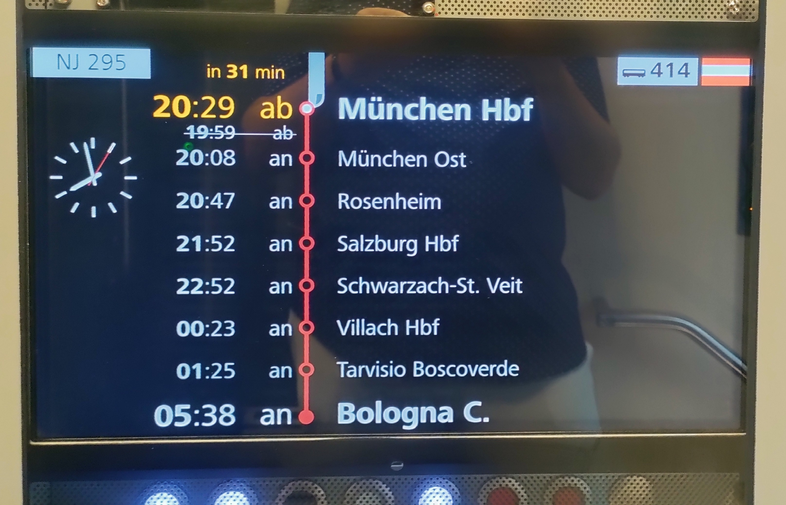

Gestartet habe ich mit einem Frühstück, dass nicht der Rede wert war. Aber Kaffee im rollenden Bett war trotzdem ein Erlebnis. 

----

Noch ganz kurz zu Nachtzug ja oder nein: Ich kann die Reise damit empfehlen. Es macht Spaß und ist gemütlich, man wird die ganze Nacht wie in einer Wiege geschaukelt. Trotzdem darf man nicht davon ausgehen, dass man super viel Schlaf bekommt, besonders, wenn der Herr über einem nachts deutlich allen zeigt, dass er nicht schlafen kann 🤷‍♂️. Wenn man die Reise als Teil des Urlaubs sieht und nicht nur als Notwendigkeit anzukommen, dann kann ich das klar empfehlen. 

----

Nach der langen Fahrt konnte ich erst einmal die Koffer im Hotel lassen und habe mir ein nettes Café gesucht. 

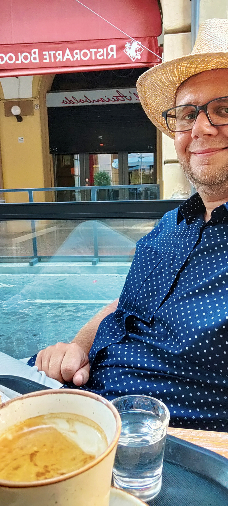

Im Hintergrund ist das Restaurant Bolognese. Das Rezept kommt aus dieser Stadt und sie ist damit Namensgeber für die berühmte Hackfleischsauce (Entschuldigung, ich bestehe darauf *Sauce* weiterhin so zu schrieben 😃).

## Straße der Unabhängigkeit

Mein Hotel für die nächsten beiden Nächte, welches sich hoffentlich nicht bewegt, befindet sind an der Via dell'Indipendenza. Wenn ich nicht falsch liege, ist damit an die Befreiung von den österreichischen Herrschern im 19. Jhd. erinnert.

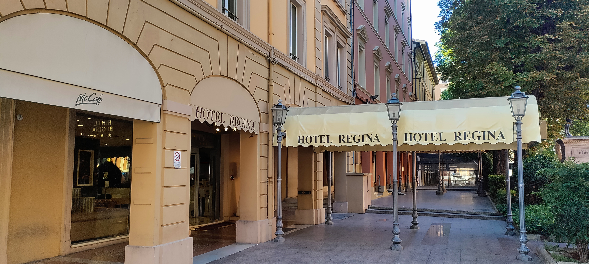

Diese Straße ist eine der wichtigsten Straßen, weil sie den Bahnhof mit der Innenstadt verbindet. Nicht jeder kann, wie Leipzig, seinen Bahnhof direkt im Zentrum bauen. Als wichtige historische Straße befanden sich schon immer große, herrschaftliche Häuser hier. Besonders bekannt sind die vielen Arkaden, die es hier gibt (aber auch an anderen Straßen).

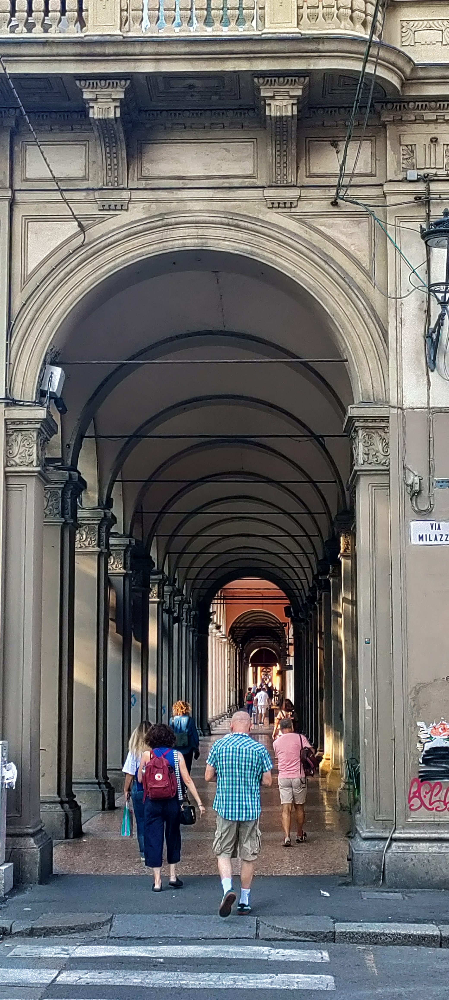

Diese Arkaden erfüllen ihren Zweck hervorragend: Schatten spenden uns Verkehr von Fußgängern trennen.

----

Auch interessant: in Bologna wird die Straßenbahn wiederbelebt. Es gab wohl bis in die 60er Jahre ein Straßenbahnnetz, was dann aber stillgelegt wurde. Überraschenderweise hat man festgestellt, dass ein ÖPNV doch praktisch ist und baut nun ein neues Netz auf. 

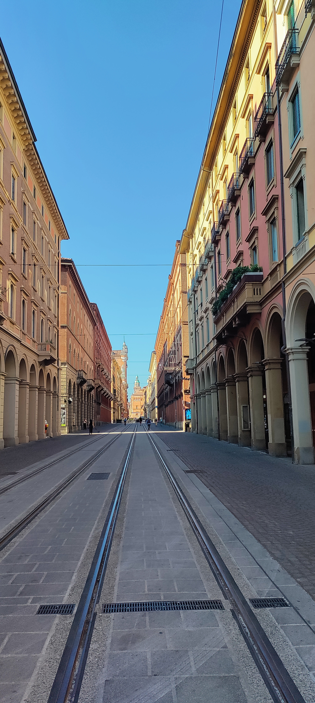

## Santuario della Madonna di San Luca

Etwas außerhalb von Bologna, auf einem Berg, liegt eine kleine Basilika. Gewidmet der Jungfrau vom Heiligen Lucas. Da es morgen noch wärmer sein soll, bin ich den Aufstieg direkt angegangen.

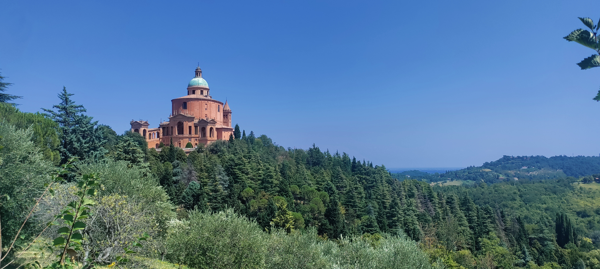

Eine wirklich beeindruckende Kuppel mit einer großartigen Aussicht. 

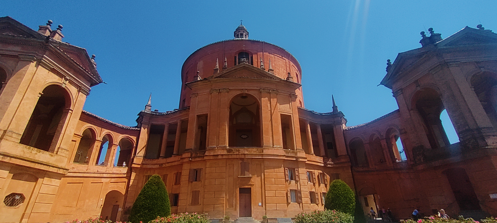

Wie häufig sieht das von unten gar nicht so weit oben aus. Wenn man dann aber aufsteigen muss, zieht sich das. Es gibt einen sehr schönen Bogengang, der von ganz unten mit 666 Bögen nach oben führt. Der Gang bietet Schatten und Darstellungen mit biblischen Geschichten. Wenn es steiler wird, wechselt die Schräge auch zu Treppenstufen. 

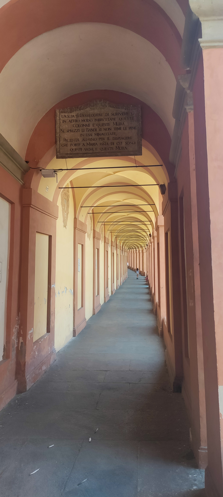

Wenn man nur in der Altstadt herumläuft vergisst man schnell, dass die Stadt rundherum eine Großstadt ist. Das Panorama hat das wieder ins Gedächtnis gerufen, mit Flughafen, Stadion und Hochhaussiedlungen.

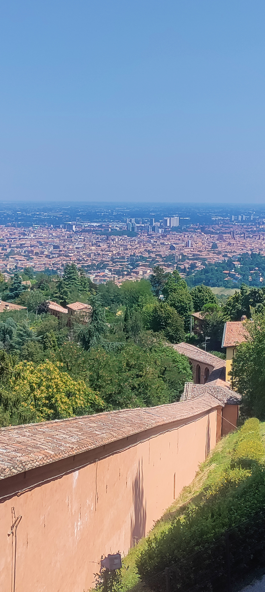

## Kino unter den Sternen

Aktuell gibt es ein [Kinofestival](https://cinetecadibologna.it/programmazione/proiezione/ce-ancora-domani/?repeat=22213&festival=sotto-le-stelle-del-cinema-2026). Teil davon ist eine riesige Leinwand, eine Menge Stühle und jeden Abend ein anderer italienischer Film.

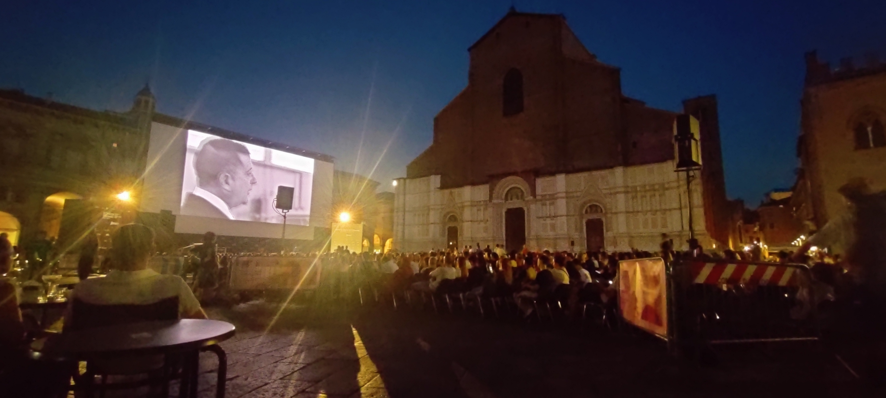
 
Ich habe entdeckt, dass der heutige Film zufällig einen englischen Untertitel hat, also bin ich hin. Eine tolle Kombination aus Arte-Filmfeeling (Originalsprache mit Untertitel und sogar schwarz-weiß) und Festival-Stimmung. Ich habe eher am Rand in einer Bar gesessen, so gab es immer etwas zu treiben beim Schauen. Großartiger Abend. 

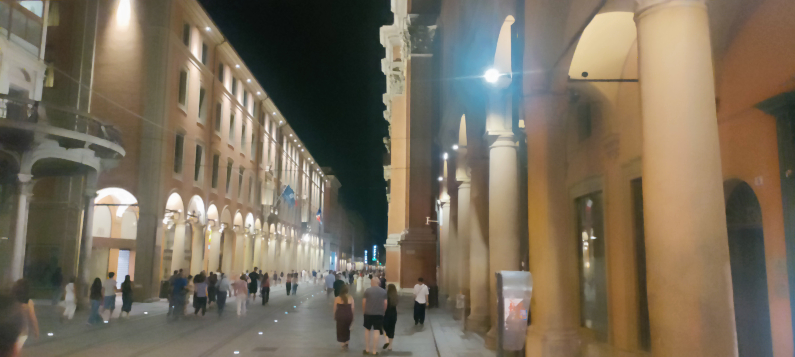

## Giardini Margherita

Heute war mir erst einmal nach Park, speziell der Margherita Garten. Gleich am Eingang steht der Fibonacci Baum. Ich weiß nicht, warum der du heißt. Mit fällt nicht ein Grund ein. Auch nicht 1, 2, 3, 5, 8 oder 13 Gründe.

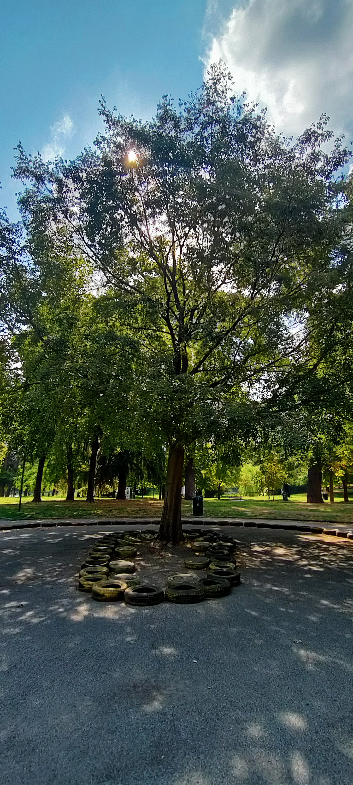

----

Hier in der Gegend gibt es sehr viele riesige, alte **Z**edern in denen die **Z**irkaden wirklich laut **z**irpen. Dieser riesige Baum ist eine **Z**ypresse, allerdings eine für die Region eher untypische Art. Das ist ein [Riesenmammutbaum](https://de.wikipedia.org/wiki/Riesenmammutbaum) (Sequoiadendron giganteum), der wohl immerhin schon über 150 Jahre hier steht.

**Ich bin einen weiteren Tag in Bologna, es lohnt sich also, in dieses Kapitel demnächst noch einmal reinzuschauen**