## Ankunft in Genua am 29. Juli 

Genua ist eine Hafenstadt mit Bergen direkt an der Küste. Wenn man mit dem Zug ankommt, durchquert man viele Tunnel bis man plötzlich in der Stadt drinnen ist. Der Bahnsteig selber ist nur ein kleines Stück zwischen zwei Tunneln.

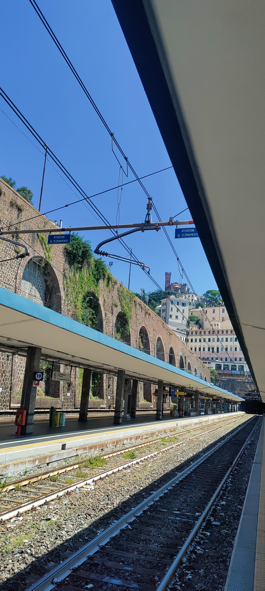

Genua muss einmal eine sehr reiche Stadt gewesen sein. Die Häuser in der Altstadt sind halbe Paläste, die Fassaden übertrieben dekoriert. 

Architekt: Was wollen sie an Dekoration?
Kunde: Ja!

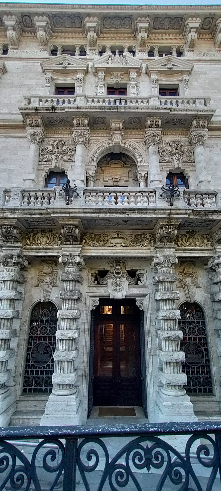

----

Ich habe lange überlegt, was sich so anders anfühlt an der Stadt. Enge Gassen und hohe Häuser gibt es auch woanders. Ich glaube, das Adjektiv, was es für mich beschreibt ist dreidimensional. Ich meine damit, dass man die Stadt nicht einfach auf eine flache Karte projizieren kann. Durch die Berge ist die in Schichten gebaut. 

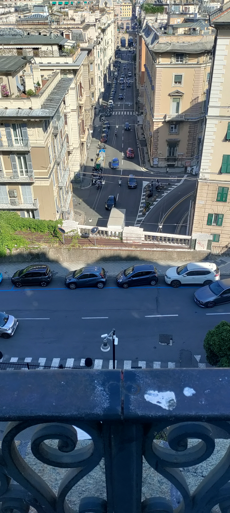

Ich stehe auf dem Bild auf einer geht normalen Straße mit Häusern am Rand. Aber auf der anderen Seite geht es plötzlich runter, wo die nächste Straße ist, die wiederum über eine Straße führt. Aber das sind eben nicht so Schnellsstraßen, die sich eben überkreuzen. Jede Ebene hat ganz normale Häuser. 

Und die Steilwände sind manchmal auch keine Felsen, sondern normale Häuserfronten. Oder auch einmal ein Triumphbogen, auf dem eine große Straße oben drauf ist. Auf den Häusern stehen Häuser.

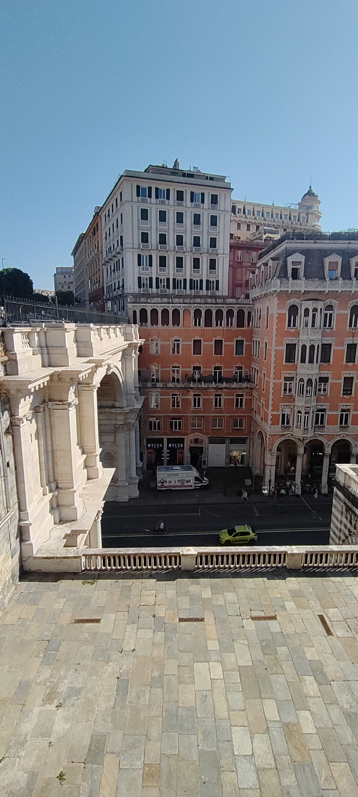

Die Leute kaufen hier bestimmt auch keine Baufläche in m2, sondern ein Baukörper in m3.

## Sightseeing als klassischer Tourist 

Ich habe beschlossen, ich verschaffe mir erst einmal einen Überblick und bin mit so einem als Eisenbahn getarnten Minibus gefahren. 

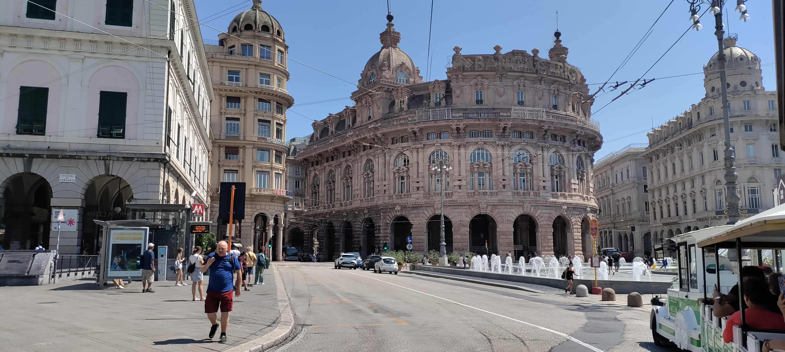

Die Fahrt folgt im wesentlichen der Hauptstraße parallel zum Wasser. Als Fußgänger kommt man aber immer nur Abschnitte entlang, weil selber die Hauptstraße immer wieder von Tunneln unterbrochen ist. 

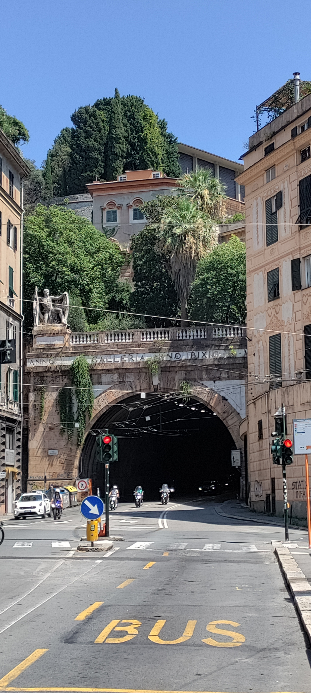

Anschließend habe ich noch den Turm der Cattedrale die San Lorenzo bestiegen. Ich war tatsächlich der einzige dort oben, was bei der Kombination aus Temperatur und Treppenstufen nachvollziehbar war. Allerdings hat die Aussicht nur bestätigt, dass man mit einer Draufsicht hier nicht weiterkommt.

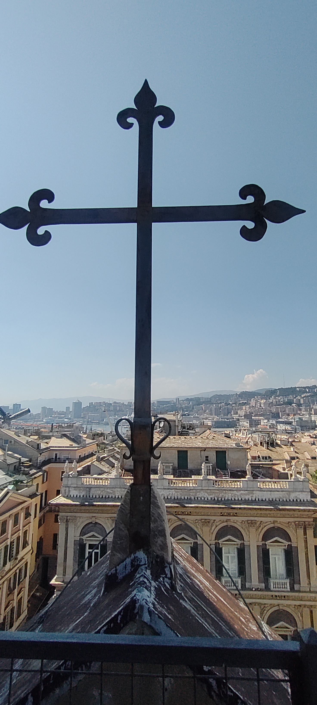

Von innen war die Kathedrale aber auf jeden Fall ein Hingucker. 

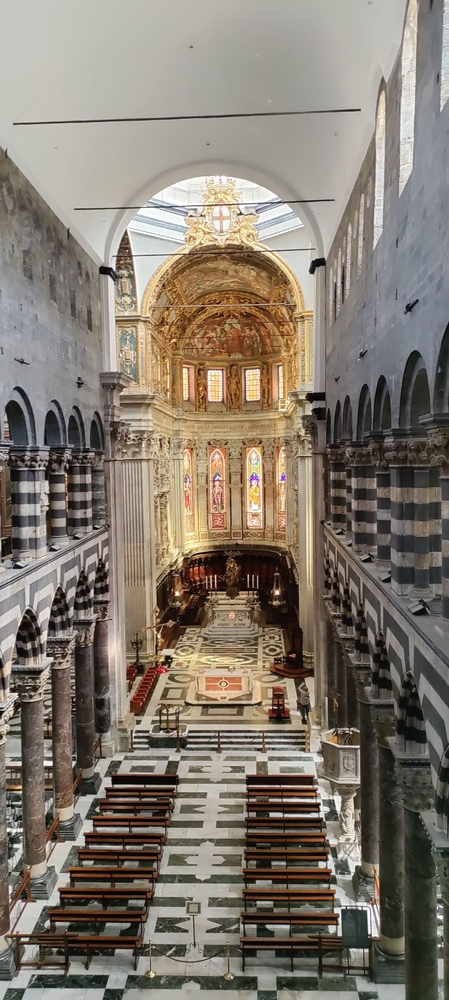

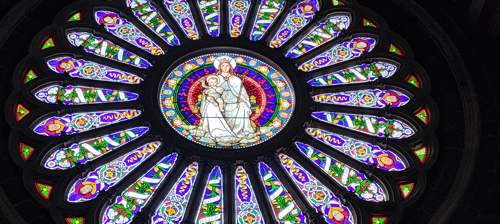

## Villetta Di Negro

Mitten in Genua bin ich dann auf einen wunderschönen Park gestoßen. Fast schon wie ein Geheimtipp. Der ist angelegt wie ein botanischer Garten, also auch mit beschrifter Flora. 

Aber da die Wege auch dort eher vertikal angelegt waren, hab es sogar einen künstlichen Wasserfall. Wirklich toll zum entdecken, mein kleines Highlight für heute.

## Abend und Nachtleben

Zur Stärkung in ein kleines Restaurant. Mit dieser Auswahl hatte ich wirklich Glück. 

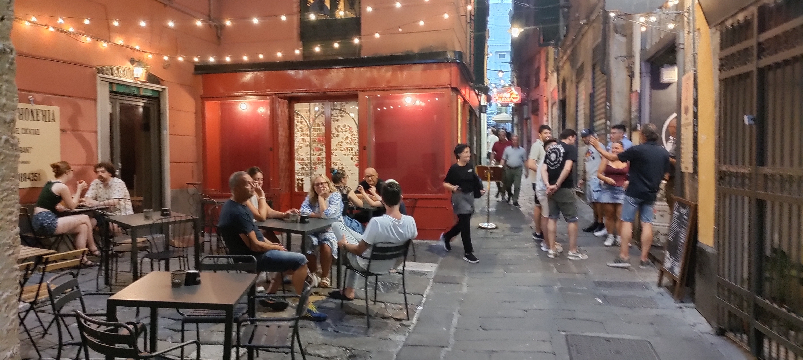

Das war nicht nur unglaublich gemütlich, sondern auch echt lecker. Wenn ihr einmal hier seid kann ich das La Cialtroneria empfehlen. 

----

Wie üblich spielt sich das Nachtleben in einer Hafenstadt am Wasser ab. Überall Musik, entspannte Stimmung und Schiffe gucken. 

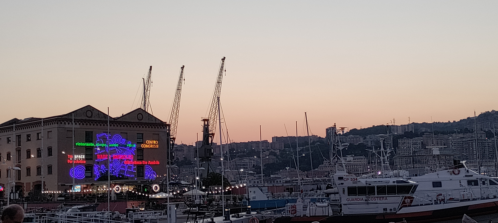

----

**Morgen geht es weiter in Genua, aber nur einen halben Tag**