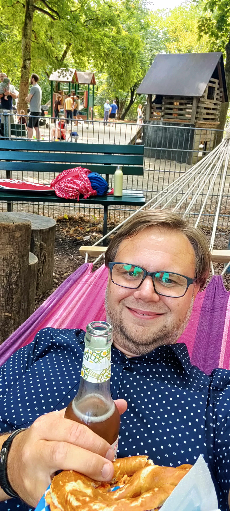
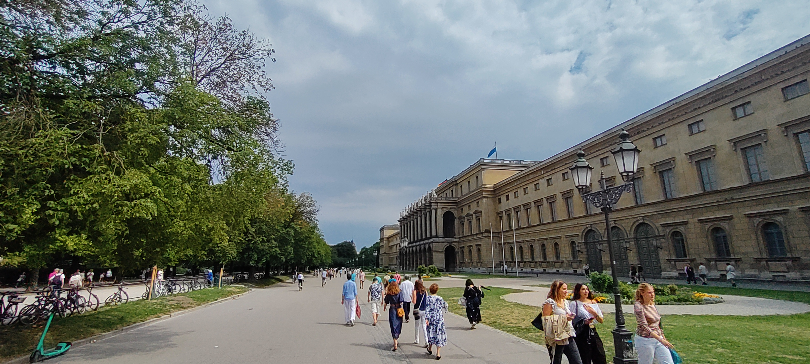

# Start am 26. Juli

Die Reise beginnt ganz gewöhnlich mit einer Busfahrt. Fast wie der Weg zur Arbeit, sogar zu einer ähnlichen Zeit. Einziger Hinweis, dass es kein Arbeitsweg ist: Es ist Sonntag. 

Morgen's früh um halb sieben in Deutschland.

----

Das hieß es erst einmal Daumen drücken, dass die deutsche Bahn die Umstiege ermöglicht. Es ging von Weißenfels über Saalfeld und Nürnberg nach München. 

Es hat tatsächlich alles geklappt, auch wenn der Zugbegleiter anrufen musste, dass die Anschlussbahn in Saalfeld wartet.

## Ankunft in München

Das ist wirklich nur ein kurzer Zwischenstopp. Es reicht noch nicht einmal für eine Übernachtung. Dafür einen gemütlichen Spaziergang in den englischen Garten. 

----

Dort habe ich mir eine Brezn mit Obazda (oder Obatzda oder Obatzta) geleistet. Passend mit Hängematte zum Entspannen. Sehr zu empfehlen. 

----

Dieser Weg hat Erinnerungen geweckt. Eigentlich schöne, wenn ich an das tolle Team von Kollegen (besser: Freunden) denke. Dort ging es entlang vom Odeonsplatz zur MPG.

