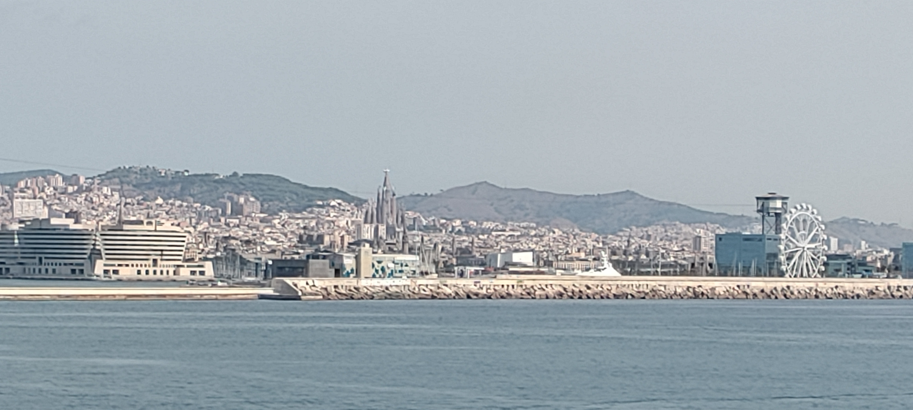
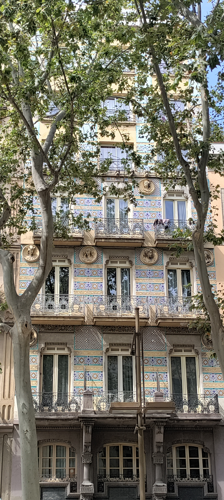
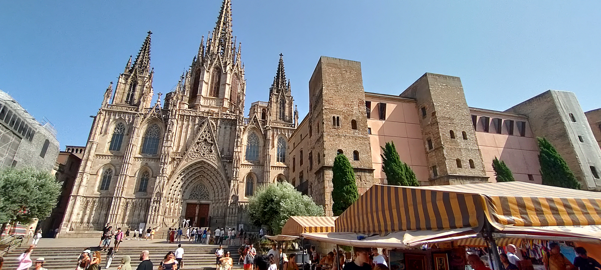
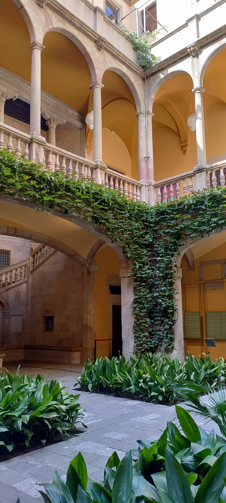
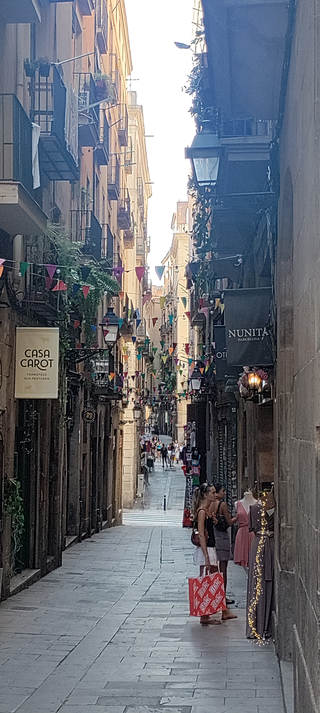
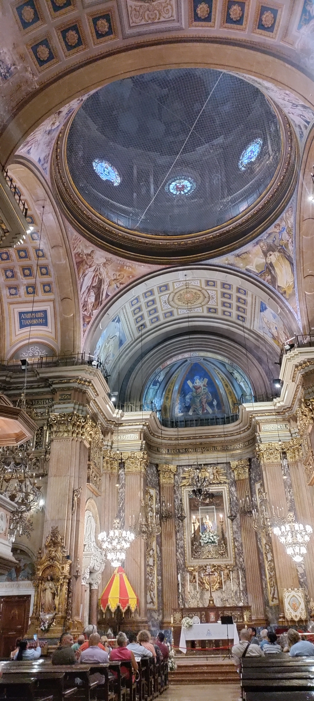
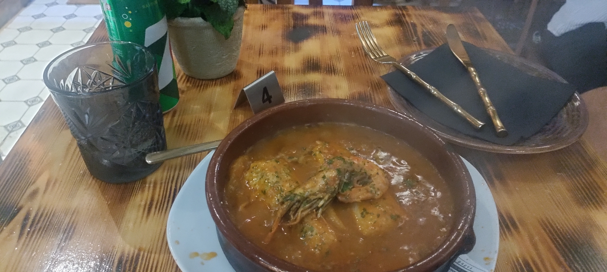

## Ankunft in Barcelona an 31. Juli

Trotz verspäteter Abfahrt sind wir überpünktlich in Barcelona eingelaufen. 

In Barcelona angekommen mussten Passagiere ohne Fahrzeug in einen Bus steigen, der eine Viertel Stunde gewartet hat, bis er voll genug für die erste Runde war. Nach einer Fahrt, die einer Laufstrecke von einer Minute entsprach, durften wir wieder aussteigen und den Hafen verlassen. Nicht ganz nachvollziehbar, aber lustig.

Gleich vorweg: Die Orientierung in Barcelona ist deutlich einfacher als in Genua. Für so alte Straßen gibt es ein erstaunlich gerade Raster, nachdem hier alles ausgerichtet ist. Also die richtige Nord-Süd-Verbindung gesucht, in diesem Fall die La Rambla, und dann immer geradeaus zum Hotel. 

Auffällig an diesen Straßen sind die unglaublich schönen Fassaden, die auch fast alle sehr gut erhalten sind. Ich habe irgendwann aufgehört Fotos bei jedem schönen Haus zu machen, weil ich sonst nie angekommen wäre. 

Verglichen mit den vorheriger Zielen ist das doch etwas größer hier. Der Weg die sind Straße entlang im Zentrum hat sich dann für eine Stunde hingezogen.

## Erster Erkundungsgang 

Da ich dieses Mal etwas mehr Zeit habe, bin ich heute einfach planlos losgegangen. Die wichtigste Achse ist die oben erwähnte La Rambla, von der man dann einfach links und rechts die kleineren Straßen erkunden kann. Die großen Sehenswürdigkeiten hat man damit noch nicht alle entdeckt, aber da muss man meistens vorher planen und reservieren. Mal sehen, was davon noch kommt.

Unter anderem bin ich ab der Kathedrale von Barcelona vorbei gekommen.

----

Und auch an diesem interessanten [Mosaik](https://es.wikipedia.org/wiki/El_mundo_nace_en_cada_beso), welches auf vielen einzelnen "Momenten der Freiheit" zusammengesetzt ist. 

----

Schön war auch dieser Innenhof. In der oberen Galerie war eine Sonderausstellung zum Thema Todesstrafe. Es ging darum, wie diese Stück für Stück in der EU abgeschafft wurde und es noch Hinterwäldler (wie China und USA) gibt, die die noch vollstrecken. 
Was das allerdings mit diesem konkreten Gebäude zu tun hat? Keine Ahnung. 

----

Neben den breiten Hauptstraßen gibt es aber auch hier die kleinen Seitengassen, die viel schattiger sind. 

## Abendgestaltung

Abends ging es dann in Basílica de la Mercè, dort gab ein ein klassisches Konzert mit einem Streich-Sextett. 

Das war natürlich meine Welt. Die Stückauswahl war allerdings sehr, wir soll ich sagen, unverfänglich. Das war einmal das Beste des 17., des 18. und 19. Jhds. Barock mit den vier Jahreszeiten (Frühling und Sommer) von Vivaldi und Air von Bach, Klassik mit dem Requiem Lacrimosa von Mozart und ein wenig aus dem ersten Satz der 5. Symphonie von Beethoven und natürlich ein bisschen Romantik mit den Ave Marie von Schubert. Aber das ist ja in Ordnung, das sind ja so bekannte Stücke, weil es so schöne und eingängige Melodien sind.

----
 
Anschließend wollte ich noch schon Paella essen gehen. Die Spanier essen üblicherweise ziemlich spät zu Abend, bis Mitternacht haben die Küchen hier häufig auf. In dem eher alternativen Künstlerviertel Barri Gotic habe ich dann ein Restaurant gefunden. Allerdings hat der Hunger gar nicht für eine Paella gereicht. Ich habe einen Fischeintopf genommen. Genau so muss der frisch am Meer schmecken. Richtig gut. 

