## Unterwegs mit dem Fahrrad

Ich habe heute die Erkundung der Stadt mit einer Fahrradtour verbunden. Zusammen mit dem Fahrradverleih und einen Guide ging das einfach im Internet zu buchen. 

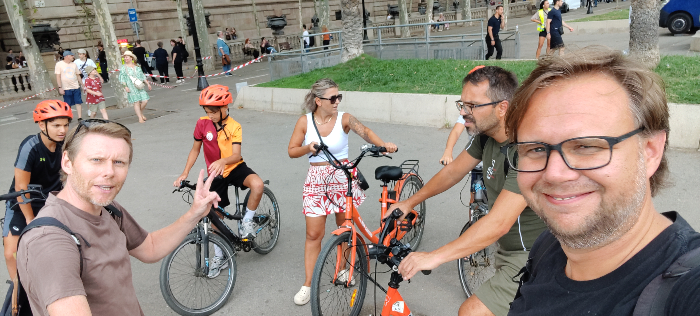

Links under Guide Peter und dahinter der Rest der Gruppe, eine holländische Familie (ich mache keinen Witz über Holländer, die eine Tour per Fahrrad machen).

Ursprünglich war die Tour auf Deutsch gebucht, aber dafür sind wohl nicht genug zusammengekommen. Das Angebot war verschieben oder die Tour auf Englisch Uhr dafür mit kostenlosen Upgrade auf E-Bike. Also bin ich E-Bike gefahren. 

So ging es dann sehr gemütlich eine kleine Runde von der großen Hauptpromenade mit Triumphbogen über die Sagrada Familia und weiteren Gaudi-Bauten eine Runde eher durch die neuere (Ende 19. Jhd. erweiterte) Stadt.

Ich vermute, dass die Route so gewählt wurde, weil in älteren Teilen (z.B. im gotischen Viertel) die Gassen zu eng für eine Fahrradgruppe sind.

----

Los ging es auf einer prächtigen Promenade, der Passeig de Lluís Companys. An der Hafenseite gibt es einen großen Park (inklusive Zoo und riesigem Brunnen). Das andere Ende markiert ein großer Triumphbogen. 

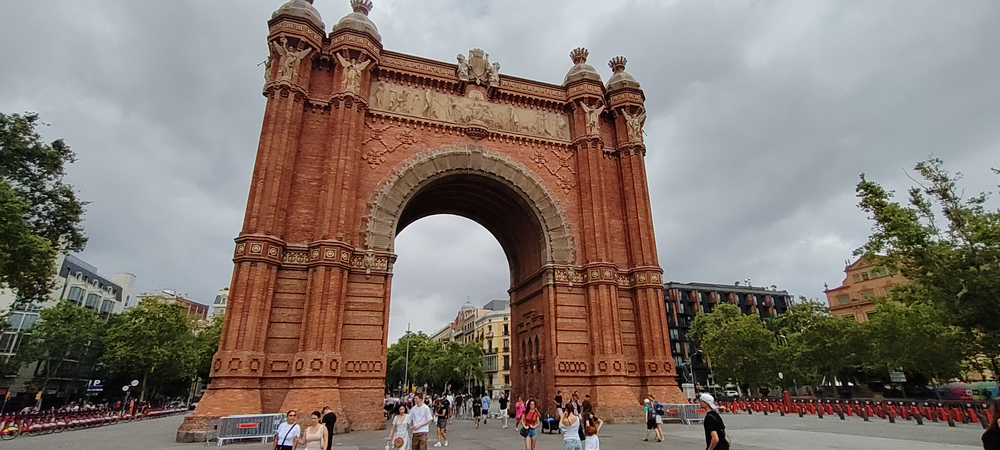

Wir sind dann aber Richtung Park gefahren und haben uns den Bühnen angeschaut. 

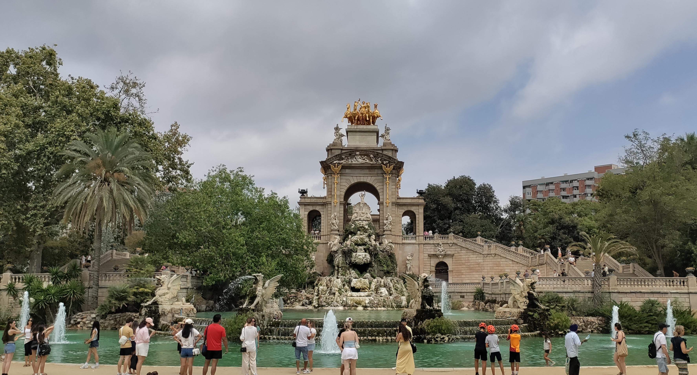

Diese Promenade und der Park bilden das östliche Ende der Altstadt Ciutat Vella. Gestern war ich ja hauptsächlich in der Altstadt unterwegs, u.a. im gotischen Viertel. 

----

Von dort ging es weiter zur Sagrada Familia. Darüber gibt natürlich unglaublich viel zu sagen, ich halte mich kurz. Diese Kirche, die inzwischen auch schon geweiht ist, wird kontinuierlich weiter gebaut. Zuletzt, vor gerade einmal zwei Monaten, wurde das Kreuz auf dem Hauptwurm installiert, gefertigt wurde es in München. 

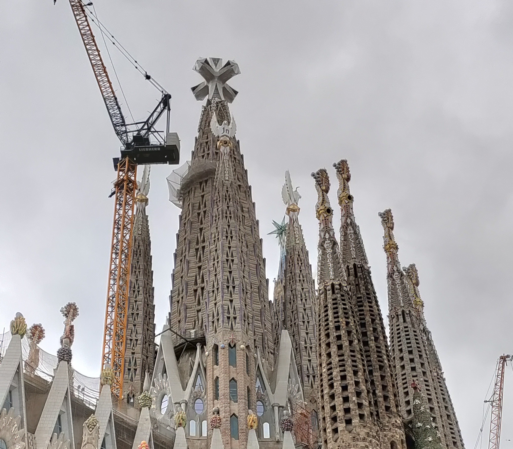

Die Entwürfe stammen von [Antoni Gaudí](https://de.wikipedia.org/wiki/Antoni_Gaud%C3%AD), der viele Gebäude der Stadt entworfen hat. Gaudi ist übrigens auf dem Weg zur Baustelle der Kirche durch eine Straßenbahn umgekommen. 

Die Kirche bekam nie Gelder von der Stadt, sondern ist komplett spendenfinanziert. Daher geht es an der Baustelle immer weiter, wenn wieder genug für den nächsten Abschnitt da ist. Inzwischen sind das natürlich auch die Einnahmen aus dem (teuren) Eintritt. Für die neuen Abschnitte bewerben dich dann die Architekten. 
Dadurch wirkt das dann auch sehr zusammengewürfelt. 

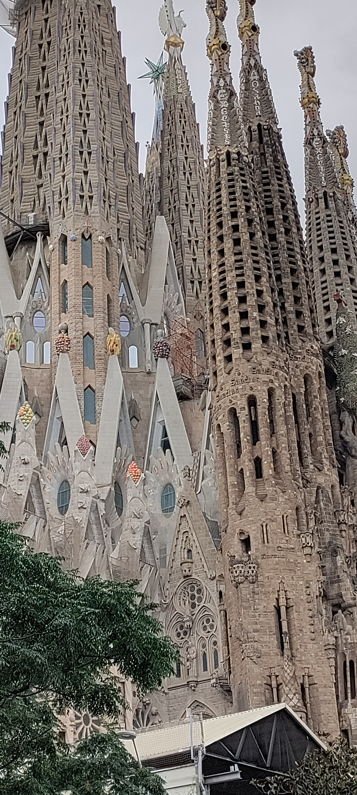

Ich werde wahrscheinlich nicht rein gehen können. Karten für den eingeben Eintritt sind bitte Ende August vergriffen. Für eine Tour gibt es noch Karten, die kosten dann aber über 100 Euro. 

----

Es gibt aber noch eine Menge anderer Gebäude, die Gaudi entworfen hat. Hier zwei Beispiele. 

Casa Mila hat die typischen geschwungenen Formen. Die Materialwahl hat den Gebäude aber den nicht schmeichelhaften Spitznamen Quarry (Steinbruch) gegeben. 

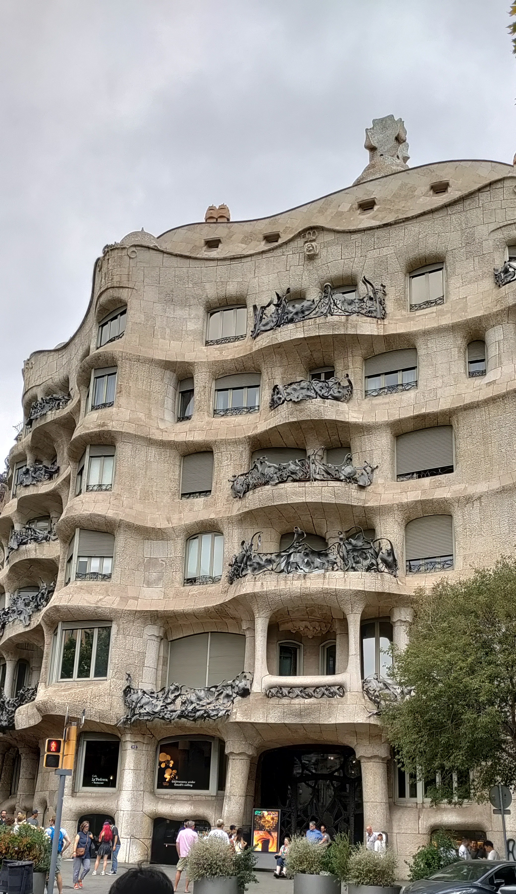

----

Ein anderes Gebäude soll an den (hier besonders wichtigen) Heiligen Georg erinnern. Also viel mehr an den Teil mit dem Drachentöten. Das Dach erinnert an die Drachenschuppen, der Turm an den Griff eines Schwertes. Einmal im Jahr, wenn der Heilige Georg heute wird, werden alle Balkone mit roten Blumen geschmückt, was das Blut darstellen soll. Die Balkone sollen den Knochen der Tiere sein, die der Drache zuvor erlegt hat. 

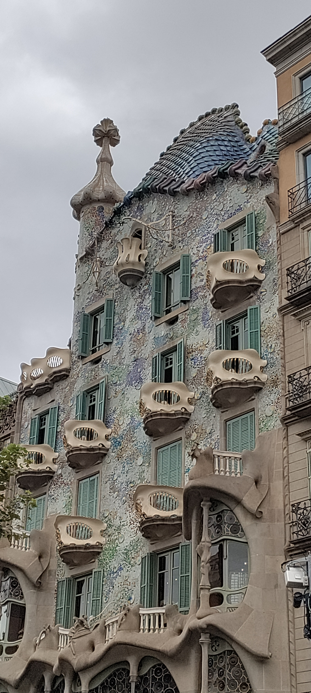

----

Insgesamt war das eine richtig gute Führung und hat mit dem Fahrrad echt Spaß gemacht. Nur E-Bike ist nichts für mich. 

## Der Abend mit Flamenco

Ich habe mir für die Gran Gala Flamenco im Palau de la Música Catalana Karten besorgt. Alleine das Gebäude ist (dieses Mal nicht von Gaudi) ein absoluter Hingucker. 

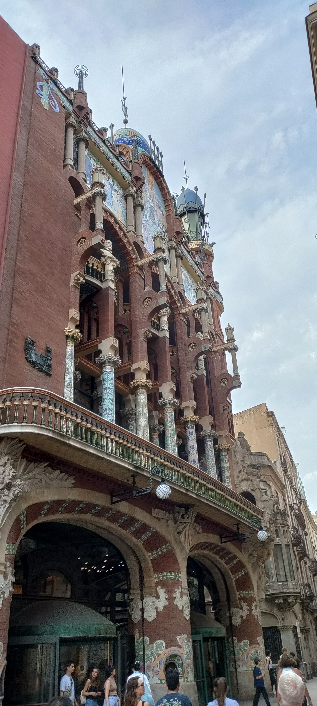

Und innen ging es genauso bunt und verrückt weiter. 

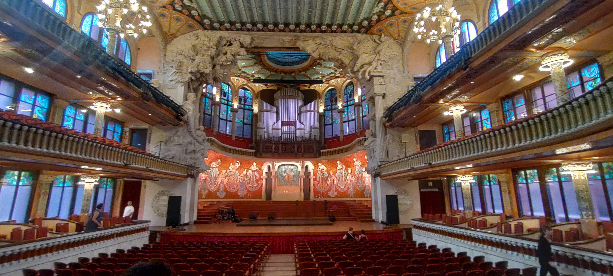

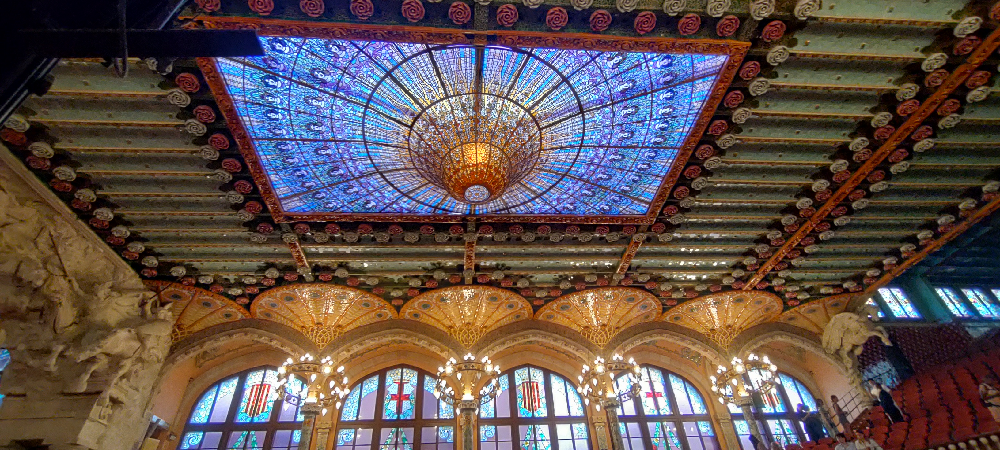

Zu sehen und zu hören hab es dann ganz tolle Live-Musik mit zwei Sängern, zwei Gitarren und einer Violine. Die Tänzer, zwei Damen und ein Herr, waren super gut (soweit ich das als Laie beurteilen kann). Das hat richtig gute Laune gemacht. 

Leider gab es ein Verbot für Bild- und Tonaufnahmen. Am Ausgang konnte man dann DVDs und CDs erwerben. Daher kommen hier ausnahmsweise einmal Bilder und ein Video, das nicht von mir ist. 

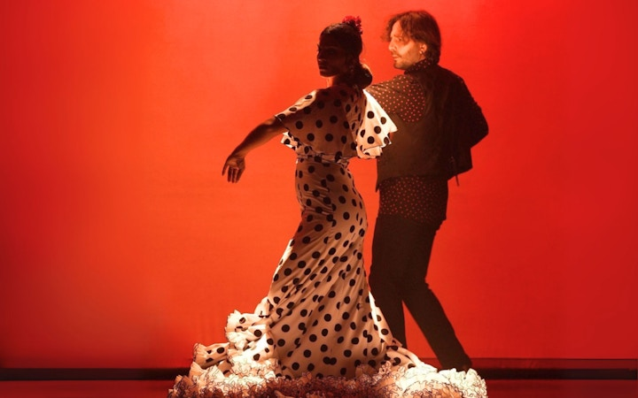

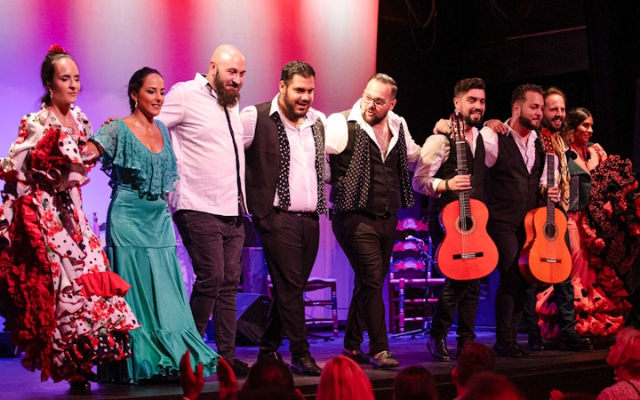

<iframe width="100%" height="auto" style="margin-inline:auto;"
src="https://www.youtube.com/embed/ri5zxYHB2oc">
</iframe>

Die Kombination aus dem Konzerthaus und der tollen Show hat das zu einem echt tollen Erlebnis gemacht. 

Einmal ganz kurz meckern. Ich weiß, das war kein klassisches Konzert, aber das Leute das über eine halbe Stunde zu spät kommen und sich zwischendurch immer wieder Leute raus- und reingegangen sind (nein, nicht die mit Kindern), fande ich sehr störend. Auch das ständig an Handy rumspielen. Die Künstler waren echt gut und so ein Verhalten finde ich respektlos.

## Abschluss

Wie gestern auch, bin ich dann noch sehr spät (typisch spanisch) essen gegangen. Ich wollte unbedingt Paella essen. Und die war richtig gut. 

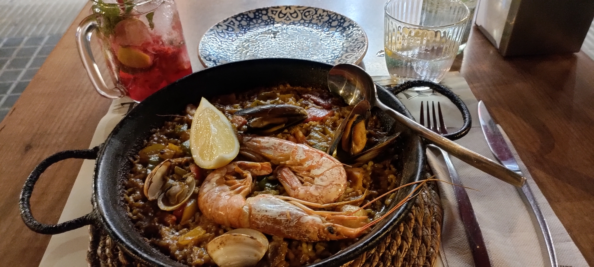