## Strandtag am 02. August

Eigentlich wollte ich heute nur zum Strand und entspannen. Das habe ich an Vormittag auch tatsächlich gemacht. 

Ein ganz toller Sandstrand mit sauberem Wasser und vielen Bars und Restaurants. 

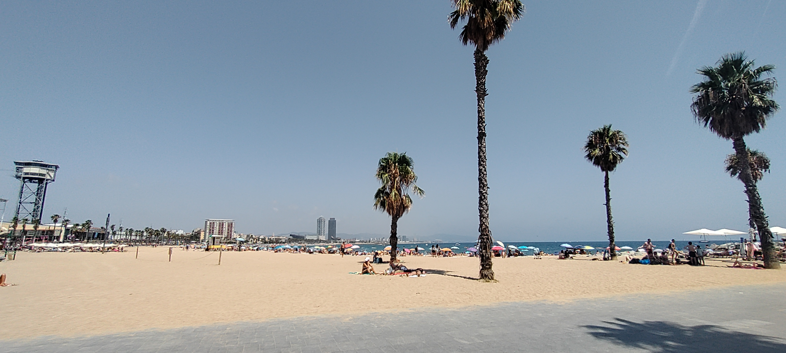

Da ich dahin gelaufen bin, wie bis jetzt alles, habe ich vor dem Baden erst einmal gut Mittagspause gemacht. 

Diese ganze Gegend (Barcelonetta) hat einen ganz anderen Charakter. Hier sind die Touristen, die zum Baden und Feiern gekommen. Dementsprechend sind auch die lokale ausgerichtet.

## Auf zum Montjuïc

Das ist der höchste Berg in Barcelona. Allerdings ist der nicht sehr hoch, sobald man das Stadtgebiet verlässt, wird es sehr schnell viel höher. 

Praktischerweise gibt es genau vom Strand bis zum Berg eine Seilbahn. Das besondere ist: Die führt hat nicht von unten nach oben, sondern startet am einem Turm und bleibt fast auf einer Höhe. 

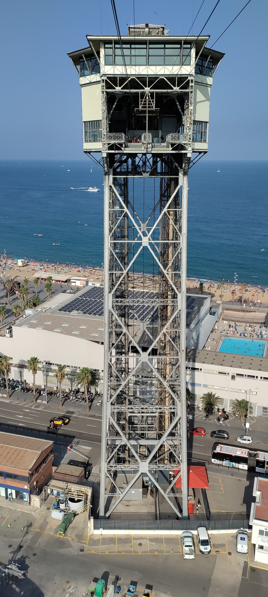

Dabei überquert sie aber den Hafen und man hat eine tolle Aussicht. 

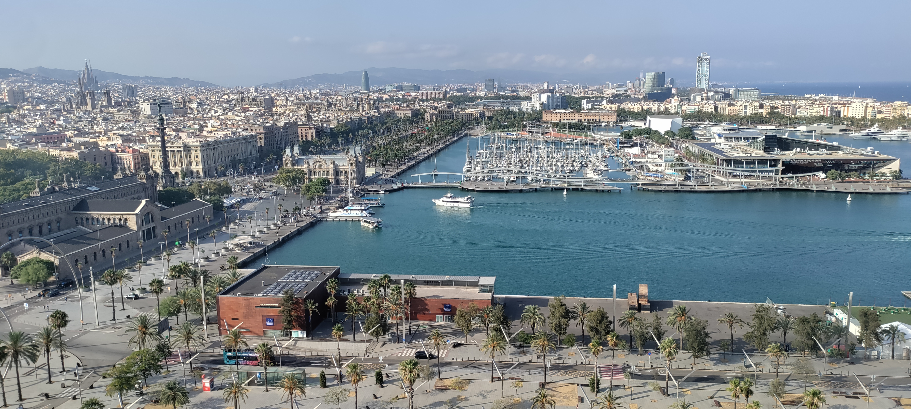

Auch auf so manches Kreuzfahrtschiff. 

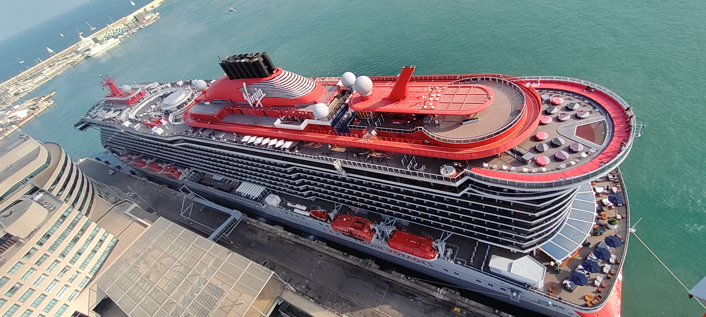

----

Auf dem Berg selber gibt es einiges zu sehen, nicht nur die Aussicht. Zum Beispiel sind dort die Sportanlagen und das Stadion zu den Olympischen Spielen 1992. Die Becken für die Wasserwettbewerbe sind heute ein Freibad. 

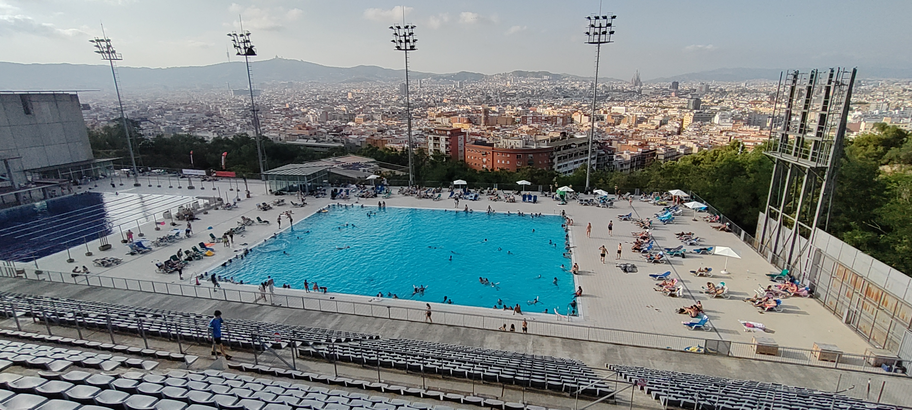

Auch der alte botanische Garten (leider geschlossen, als ich vorbei kam) und die das nationale katalanische Kunstmuseum sind dort. Das Museum ist sehr beeindruckend und zeigt einmal mehr, wie stolz die Katalanen auf ihre Region sind. 

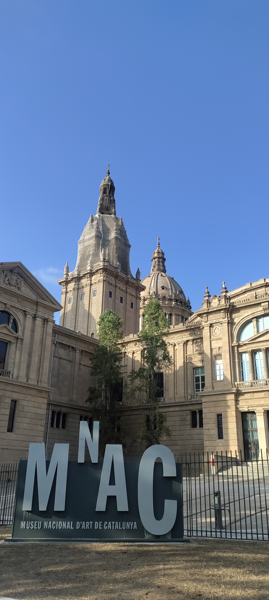

Vielleicht passend dazu etwas zu Katalanien. Es gibt ja sogar eine Bewegung, die sich darum bemüht, dass Katalanien von Spanien unabhängig wird. Und die kulturelle Trennung von Spanien ist Recht deutlich zu spüren. Katalanisch ich die Sprache hier, Spanisch quasi die erste Fremdsprache. Die Sprache ist auch nicht nur ein Dialekt, sondern eher eine Mischung aus Spanisch, Italienisch und Französisch. Auch haben die von den offiziellen Stellen auch immer eine lokale Variante (eigenes Gericht, das oben erwähnt Kunstmuseen, ...). 

----

Dieses Museum hat gleich seine eigene Prachtstraße mit riesiger Brunnenanlage über mehrere Stufen und einer großen Fontäne am Ende. Dazu gleich noch mehr. 

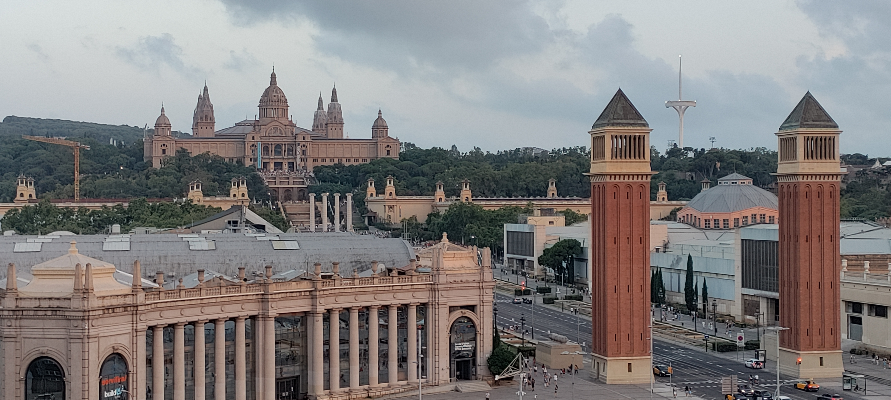

----

Zum Essen ging es dieses Mal in eine Stierkampfarena. 

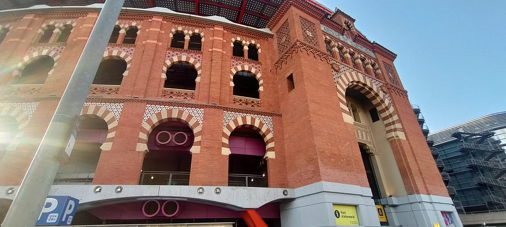

Wobei der Stierkampf inzwischen verboten ist. Daher werden die Arenen versucht anders zu nutzen, z.B. als Veranstaltungsort. Oder wie in diesem Beispiel als Einkaufszentrum.

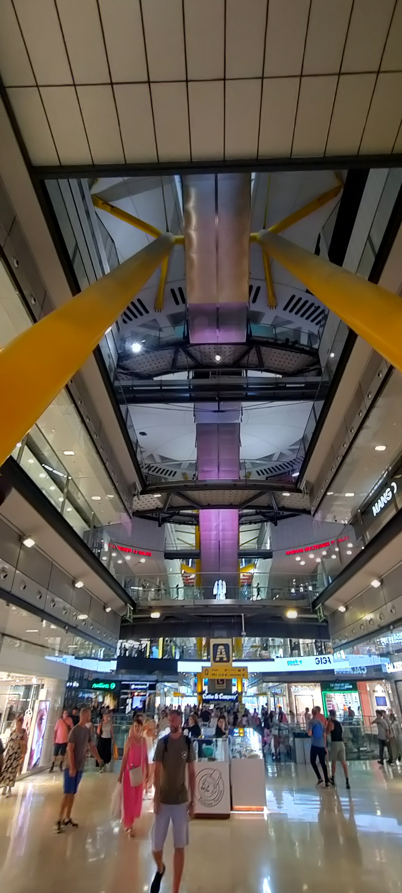

Interessant ist, dass oben umlaufend Restaurants und ein Panoramaweg sind.

----

Noch einmal zurück zum Brunnen mit der Fontäne. Das war tatsächlich der Hauptgrund, warum ich in diesen Stadtteil wollte. Über Guide (der von der Fahrradtour) hat uns empfohlen, Sonntagabend einmal dahin zu kommen. 

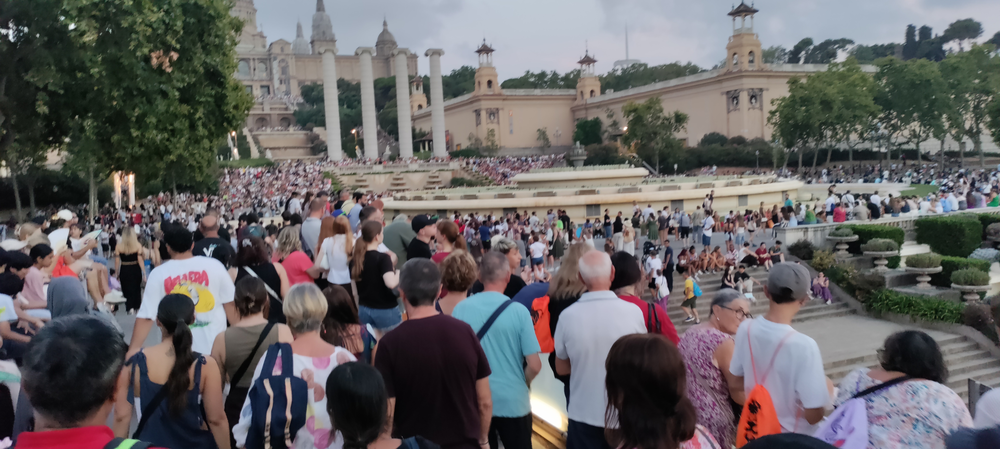

Diesem Aufruf sind sehr viele Leute gefolgt. Anlass ist eine Wasser- und Lichtshow, die erst seit kurzem wieder repariert und aktiv ist. Mit Musik überleg gab es eine ziemlich beeindruckend Darbietung. Und abgekühlt hat es auch. 

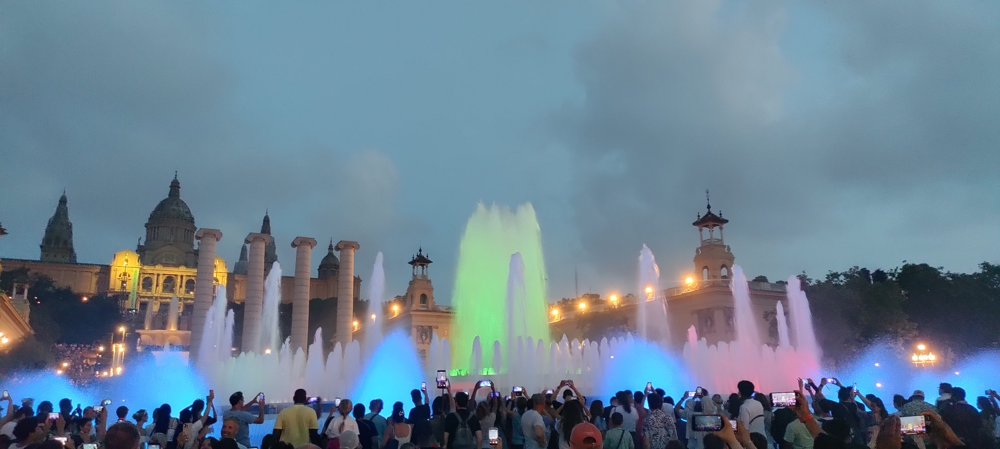

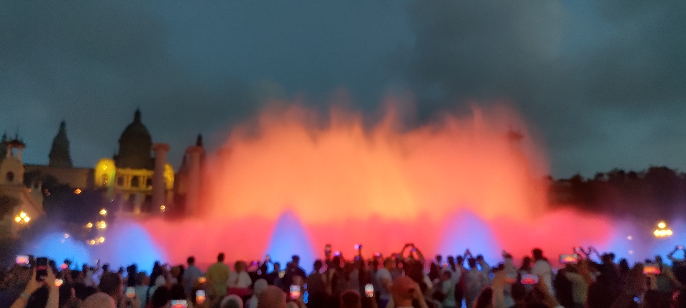

Es war fast wie eine Volksfeststimmung, es wurde auch getanzt. Da ich die Show genossen habe und nicht die ganze Zeit filmen wollte, teile ich einfach wieder einmal ganz frech ein Video von den unzähligen Aufnahmen im Netz. 

<iframe width="100%" height="500px" style="margin-inline:auto;"
src="https://www.youtube.com/embed/3tuTslqEYXQ">
</iframe>

----

Ich bin dann heute auch Abend auch auf den ÖPNV umgestiegen. Am Anfang ist es sehr schön, dass man auf dem Weg zum Ziel zu Fuß viel entdeckt. Aber die Laufwege sind doch beachtlich. Es gibt für Barcelona die Hola Barcelona Travel Card, mit der man für einen gewählten Zeitraum relativ günstig alle öffentlichen Verkehrsmittel nehmen kann. 

