## Ankunft am 04. August in Paris

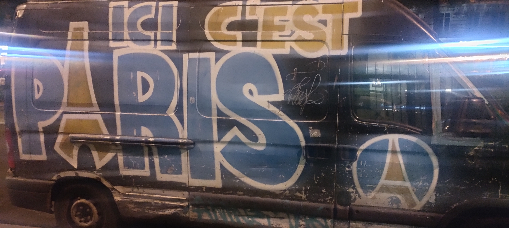

Ein kleiner Sprung von zwei Stunden mit dem Flugzeug hat mich nach Paris Charles de Gaulle gebracht. Die Fahrt im überfüllten Zug zum Hotel war nicht so angenehm, ich habe die klimatisierten Züge in Barcelona schnell vermisst.

Was ich vorher nicht gewusst habe. Nur einen Steinwurf von Hotel entfernt ist eine gewisse rote Mühle, bekannt für eher freizügiges Musiktheater. 

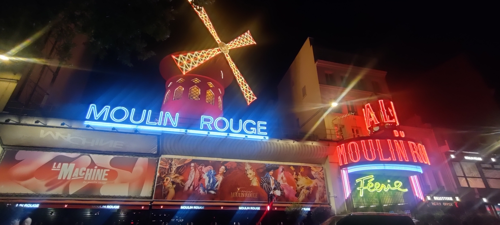

In Paris ist erst einmal alles groß. Die Straßen, die Bauten und die Strecken. Also habe ich beschlossen, erst einmal eine Erkundung vom Wasser aus zu starten. Aber auch hier, die Warteschlange war groß. Trotz bereits online gekauftem Ticket. Dadurch ist es dann so spät geworden, dass es dann eine Fahrt durch das beleuchtete Paris wurde. Sehr schön. 

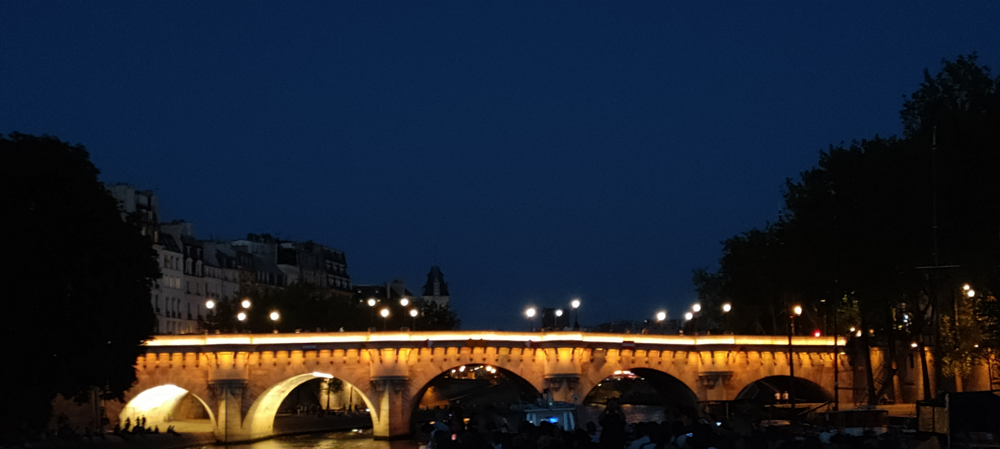

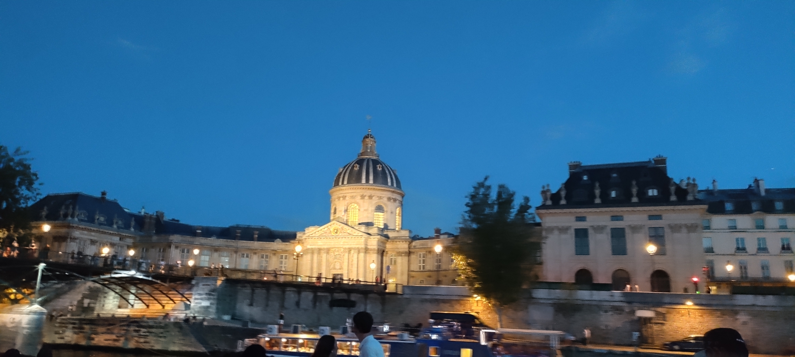

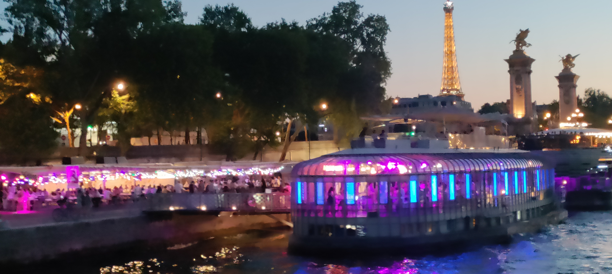

Ich schreibe nicht zu jedem Punkt einen Roman. Aber eine Anekdote möchte ich erzählen. Die Brücke Pont de la Concorde wurde während der französischen Revolution fertig gestellt. Der Beginn war ja der Sturm auf die Bastille, wie ihr alle wisst, am 14. Juli. Die Steine der Brücke kamen aus der Bastille, damit ab jetzt die Franzosen die Unterdrückung durch den Adel mit Füßen treten können. 

Am Ende kamen natürlich auch an Eiffelturm vorbei. Ab 22 Uhr leuchtet der nicht nur, sondern fängt auch an zu glitzern (hat mein Handy nicht können, ihr müsst wohl einmal herkommen).

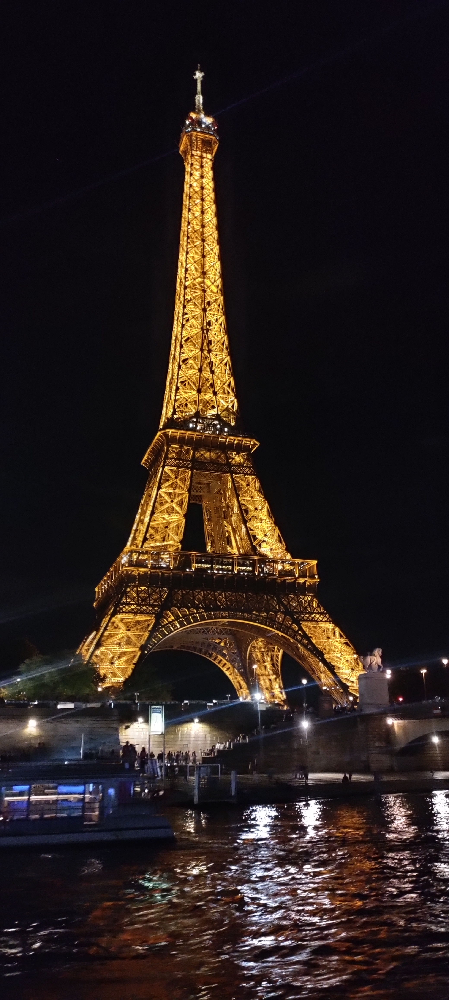

## Erkundung am 05. August

Ich habe dieses Mal auf irgendwelche gebuchten Führungen verzichtet. Stattdessen habe ich mir das Tagesticket für die öffentlichen Verkehrsmittel besorgt. Die Linienbusse kommen auch an alles Sehenswürdigkeiten vorbei. Infos zu den Punkten findet man reichlich im Netz. 

Meine wichtigste Linie, die 80, hat dabei eine schöne Runde am vielen Punkten vorbei gemacht. 

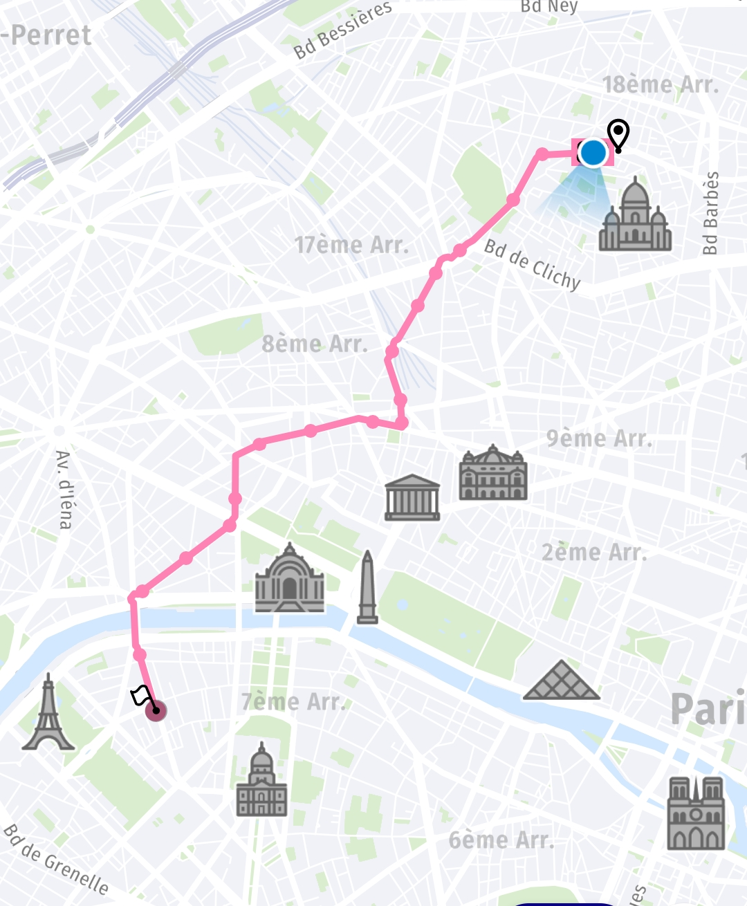

Ich habe mit der Kirche Sacré-Cœur de Montmartre begonnen. Diese ist recht nah am Hotel und gleichzeitig auf einem Berg mit schönen Überblick über Paris. 

Von dort ging es weiter zum wohl bekanntesten Punkt in Paris, der Eiffelturm. Der ist deutlich höher, als man sich das vorstellt, bzw. auf Bildern vermutet. Mit 330m Höhe fehlt jegliche Referenz in der Umgebung, um das auf Bildern einschätzen zu können. 

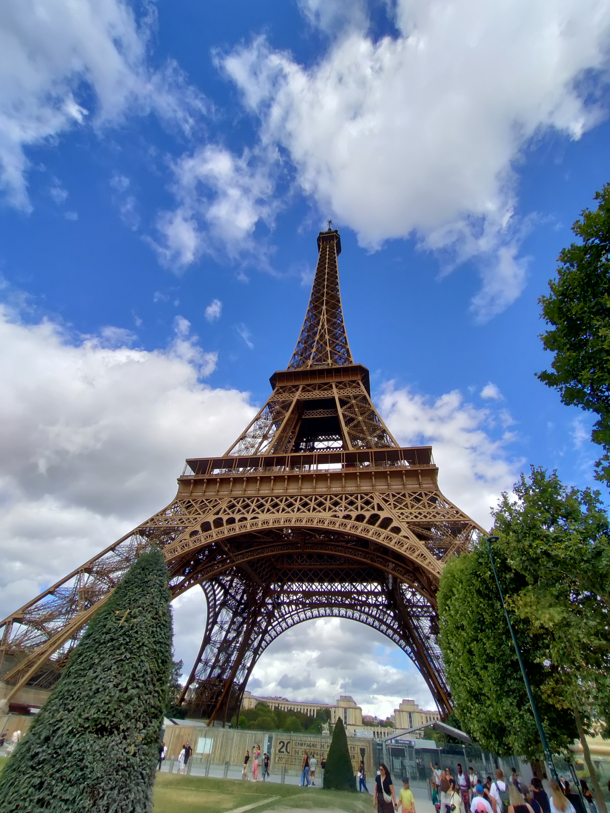

Ich habe dann auch die volle Tour bis zur Spitze mitgenommen. Dort steht man auch 280m Höhe, darüber können nur noch die Antennen. Und ich habe dort die höchste Toilette von Paris genutzt. Und ja, man merkt ein Schwanken im Wind.

Ganz oben in der Spitze hat sich übrigens Gustav Eiffel ein kleines Arbeitszimmer einrichten lassen, in dem er auch Gäste empfangen hat.

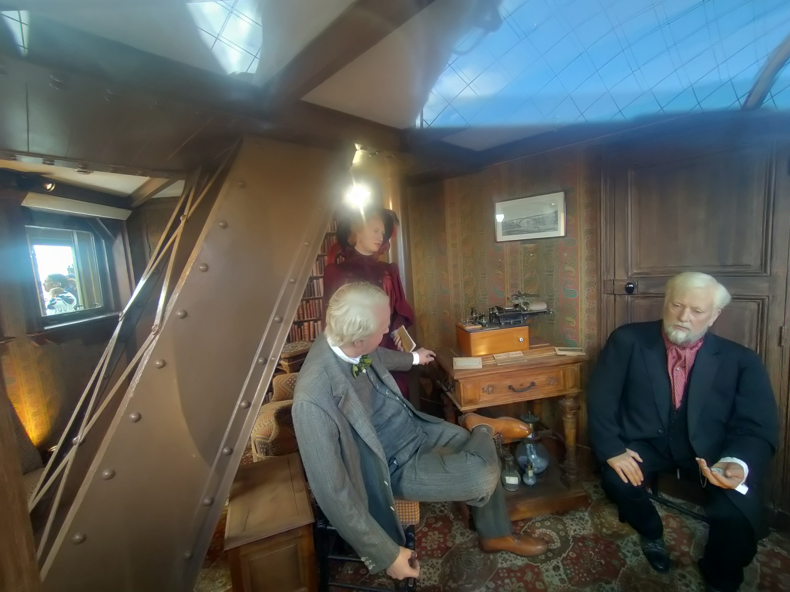

Jetzt kann man da oben völlig überteuert Champagner zum Anstoßen kaufen. 

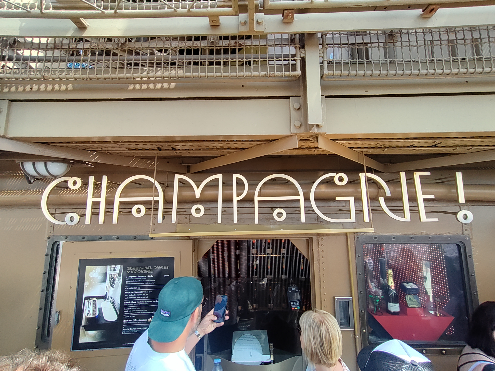

Die zweite Plattform auf 115m fühlt sich schon hoch an, bis dahin ging es die Treppe rauf, danach per Aufzug. Es gibt sich für den ersten Abschnitt einen Aufzug in den Pfeilern. Die sind zweistöckig und nicht ganz vertikal, sondern folgen den Schrägen. Früher saß ein Fahrstuhlführer an der Außenseite. 

Wieder unten habe ich mich mit dem Bus zum Arc de Triomphe fahren lassen. Wie alles ist der in erster Linie beeindruckend groß.

 

 Von dort führt die (tut mir leid für den Ohrwurm) Avenue des Champs Élysées zum Place de la Concorde. Ich weiß auch nicht, ist halt eine große Straße mit Markengeschäften. 

Ich bin lieber in die Metro und zum Rathaus gefahren. Das ist schon schön und, ihr habt es erraten, groß.

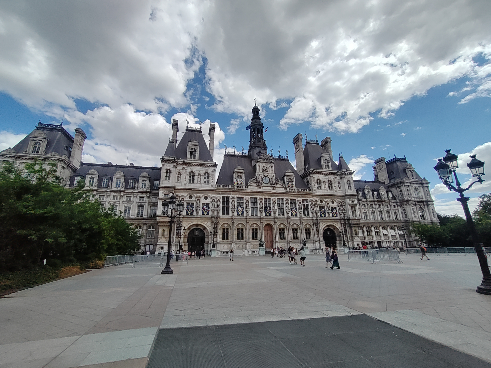

Weiter, mit Stopp für Mittag, bin ich zum Centre Georges-Pompidou gelaufen. Das ist interessant. Hier wurde das Innerste nach außen gedreht. Das heißt, der Architekt hat die Infrastruktur außen an der Fassade angebracht anstelle die zu verstecken. Genutzt wird das heute wie Kultur- und Kunststätte.

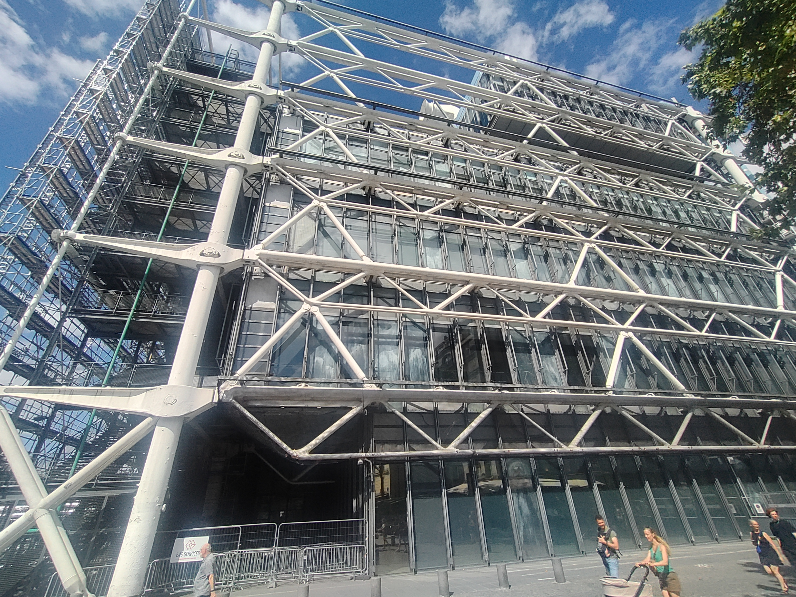

----

Eine Anmerkung zum Busfahren. Das klappt alles ziemlich gut, aber die Haltestellen sind echt unauffällig. Es gibt natürlich auch die, dir ein Häuschen haben, aber die anderen habe ich manchmal ganz schön suchen müssen mit dem kleinen Schildchen. 

Noch interessant: Man muss sich beim Ticketkauf entscheiden, ob man Metro und Regionalbahn fahren will, oder Bus und Straßenbahn. Das sind unterschiedliche Tarife. Eine Ausnahme ist das Tagesticket, damit kann man dann wieder alles fahren. 

----

Weiter auf der Runde ging es zur Kathedrale Notre Dame. Diese Kirche liegt auf einer Insel und ist in einer wirklich schönen Gegend. Ihr habt schon gemerkt, ich berichte gar nicht aus dem Inneren, was an der Schlange vor dem Eingang liegt. 

Aber ich möchte anmerken, der Eintritt ist frei. Man kann lediglich kostenlos ein Zeitfenster für den Zugang reservieren. Zum Vergleich, auch ohne Führung war die Sagrada Familia in Barcelona für fast 30 Euro Eintritt zu haben. 

Abschluss des Tages, und des Urlaubs, bildet ein schönes Abendessen in Montmartre, dem Künstlerviertel in Paris. Man sitzt direkt an der Straße und kann das Leben und Treiben beobachten. 

## Ende, Rückfahrt an 06. August

Ich weiß, dass ich natürlich von Paris nur einen winzigen Teil gesehen habe, auch weil ich mich natürlich auf die touristischen Highlights gestürzt habe. Aber dieser erste Eindruck war schon sehr gut.

Zurück geht es mit dem Zug, erst der TGV, dann weiter im ICE. Ich möchte anmerken, dass der TGV pünktlich abgefahren ist. Auch kein anderer Zug auf der Anzeigetafel hatte Verspätung angekündigt. Dafür sind wir dann in Deutschland eine Stunde zu spät eingefahren, den Umstieg von 73 Minuten habe ich damit R8echt gut ausgenützt.

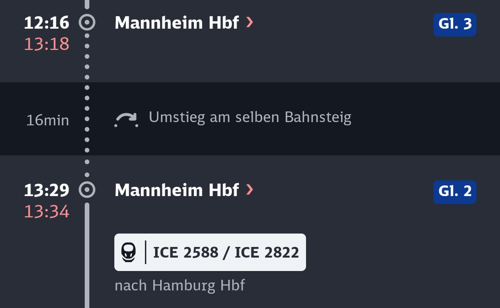

Das letzte Stückchen von Leipzig mit den üblichen Bummelzügen. 