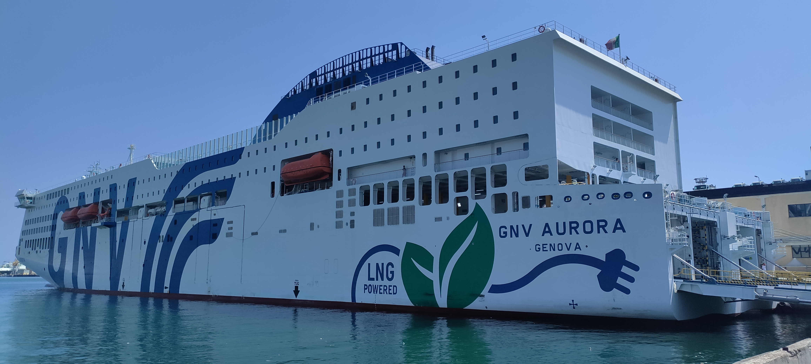
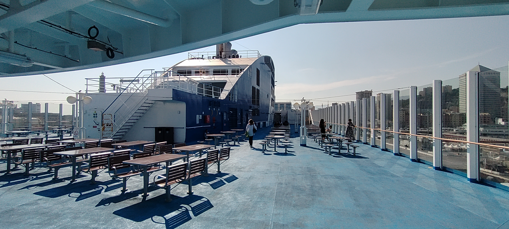
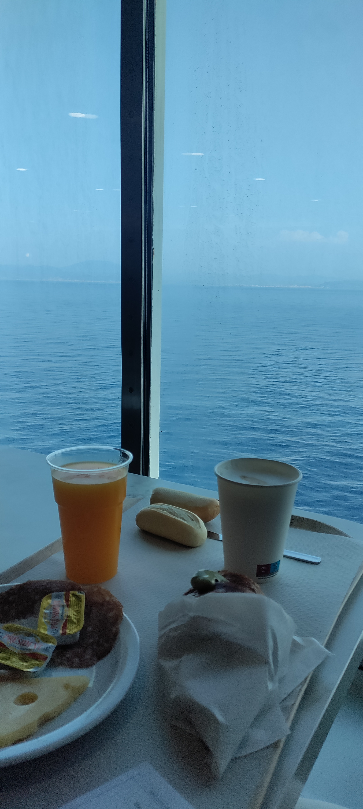
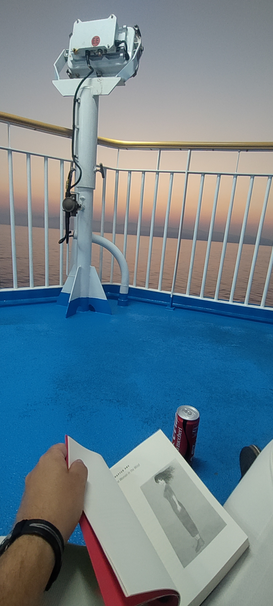
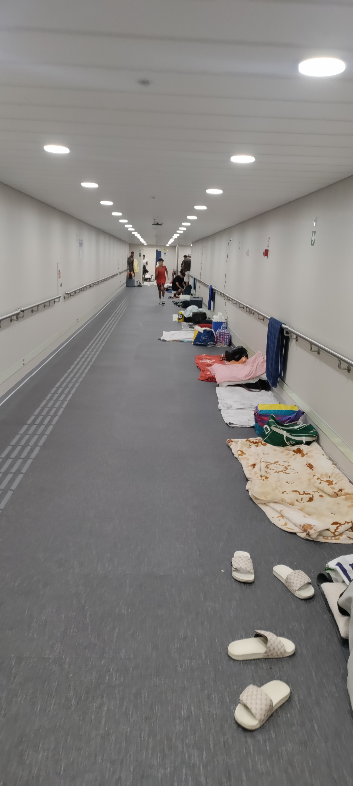
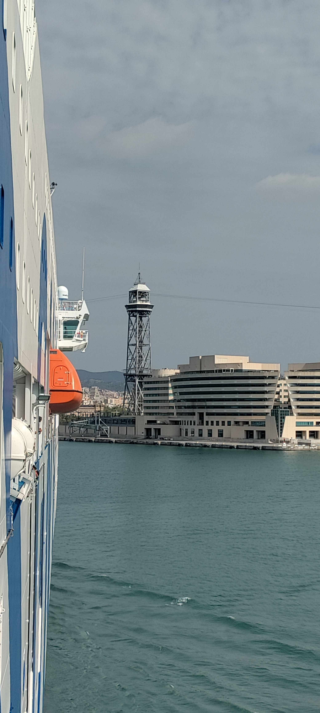

Ich habe noch ein wenig zum Schiff gelesen. Die [GNV Aurora](https://it.wikipedia.org/wiki/GNV_Aurora) ist dieses Jahr im Januar erst in Betrieb gegangen. Die vier Motoren können mit LNG betrieben werden, GNV macht Werbung mit der Umweltfreundlichkeit des Schiffes. Es passen 600 Autos auf diese Fähre und über 1700 Passagiere. Meine Kabine ist auf Deck 9, Deck 10 ist das offene Deck mit Aussicht.

Die Dinge, die jetzt kommen, klingen erst einmal nicht so toll. Aber das ist eine Frage der Einstellung. Man darf das halt nicht wie eine Kreuzfahrt betrachten, sondern wie ein Fähre. Es gab keine 10 Restaurants und am Abend eine Theateraufführung. Aber man konnte gut satt werden und die Aussicht beim Essen war großartig. 

Abends habe ich mich dann einfach für mich bis spät in den Abend an die Reling gesetzt und gelesen, während die Seeluft mich anpustete. Auch die zwangsweise Internetpause war eher erholsam. Ich würde diese Fahrt immer wieder machen und habe das sehr genossen.

Eine Sache war allerdings etwas schwierig. Die Fähre fuhr anschließend weiter nach Marokko. Sehr viel Reisende haben anscheinend die Überfahrt ohne Kabine gebucht. Das heißt, die ganzen Gänge wurden dann als Schlaflager umgebaut. Die Leute waren alle nett und haben mich auch nicht gestört, aber es ist schon ein etwas komisches Gefühl, wenn man alleine in seine Vierbettkabine mit Bad geht und vor der Tür die Familie auf dem Boden schläft. 

Am nächsten Morgen sind wir dann überpünktlich (obwohl wir zur spät losgefahren sind) angekommen. Also habe ich mich mit dem Frühstück beeilt und bin raus, um die Einfahrt nicht zu verpassen.

 Und haben dann kurz auch noch Delfine begleitet, die über die Schiffswellen gesprungen sind. Toll, aber zu schnell wieder vorbei, um das Handy rechtzeitig bereit zu machen. Das kann ich also nicht zeigen. Dafür habe ich aber aufgenommen, wie der Lotse an Board gekommen ist.

<iframe width="100%" height="500px" style="margin-inline:auto;"
src="https://www.youtube.com/embed/VOG1ZKxq3Jc">
</iframe>

